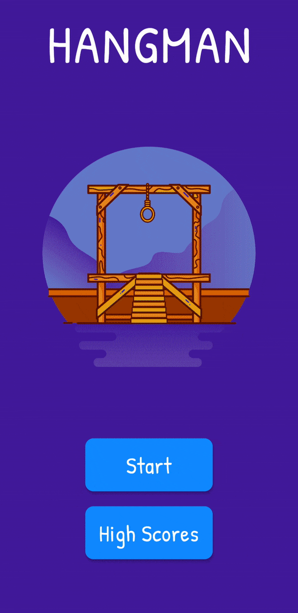
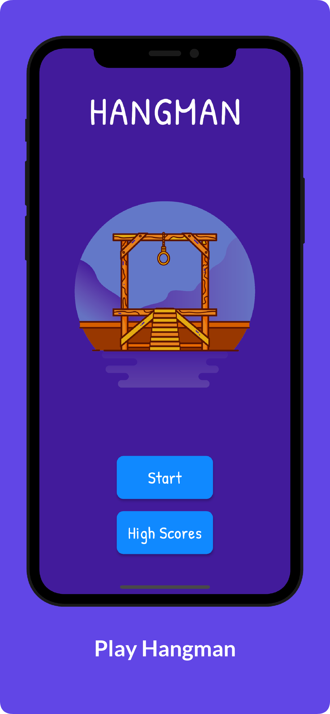

# Hangman

Un jeu du pendu écrit en Dart avec le framework Flutter. Le joueur a 5 vies à chaque tour. Les scores précédents peuvent être consultés dans la page des Meilleurs Scores.

## Screenshots

App screenshots created with <a href="https://previewed.app/">Previewed</a>

## License

Released under MIT License. See [LICENSE](LICENSE) for more info.
